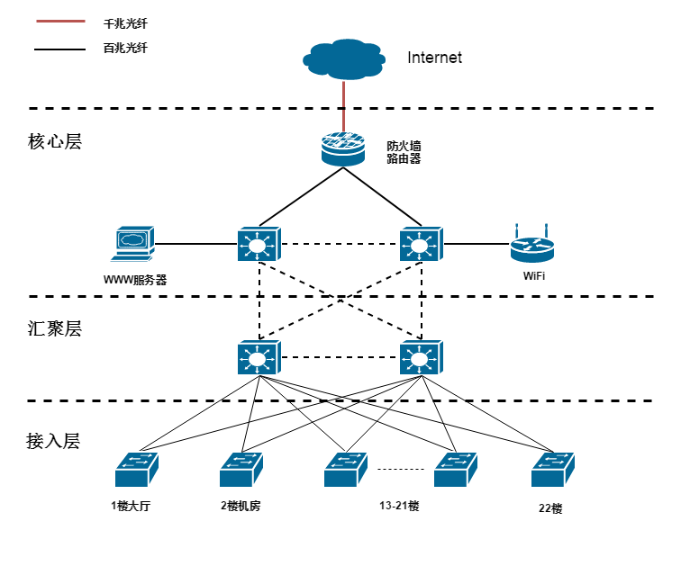

## hotel network design

某酒店网络工程设计


### 技术支持

*VLAN 虚拟局域网
*OSPF 开放式最短路径优先内部网关协议
*ACL 访问控制列表
*NAT 网络地址转换

### 结构

```
- 项目进度计划表
- 某酒店网络工程课程设计报告
- pkt			#cisco packet tracer 模拟实验
- images		#相关拓扑图
```

### 使用
* 查看配置
```
> enable
# show run 
```
* 查看路由表
```
> enable 
# show ip route
```
* 检查网络通畅
` ping ip地址

更多信息请参考《某酒店网络工程课程设计报告》
